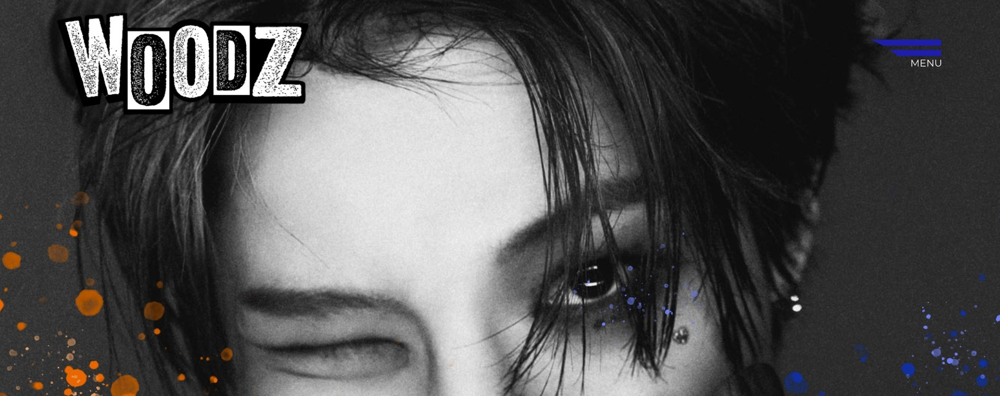

# EXAM_mai2022

  
[Visit deployed site here](https://woodz.netlify.app "WODDZ homepage")

---

# Process and result

We could choose any topic for what to base the content of the website on. I chose to create a homepage for a music artist named WOODZ where the blogs posts content would be represented as the discography.

The design process was fun, and I spent some time in Photoshop trying to figure out how to add details such as paint splashes as decor.

At this point I still don't feel too confident about my skills in using JS to creating smooth-working and smart functionality. The homepage is supposed to have a carousel of images that links to the different posts you can view. The end product doesn't work as well as I had hoped and I believe the issue lies with my use of async and how to fetch the posts before showcasing them in this specific format.

The code is also quite messy and I want to improve my code by making it more practical and readable.

---

# Assignment

Create a Wordpress headless CMS blog about any topic of your choice.

The page should include at least the following:  
Home page, about page, list of blog posts, blog post specific pages, contact page.

No use of frameworks allowed. Only vanilla HTML, CSS and JavaScript.

The contect of the website should be stored on a Wordpress installation used as a headless CMS. Wordpress is only used to provide an API, and the final product is not to be delivered as a wordpress site.

<!-- WP
https://momis.world/exam1/wp-admin/edit.php

(POSTS)
https://momis.world/exam1/wp-json/wp/v2/posts

(?PARENT=62)
https://momis.world/exam1/wp-json/wp/v2/media?parent=62 -->
